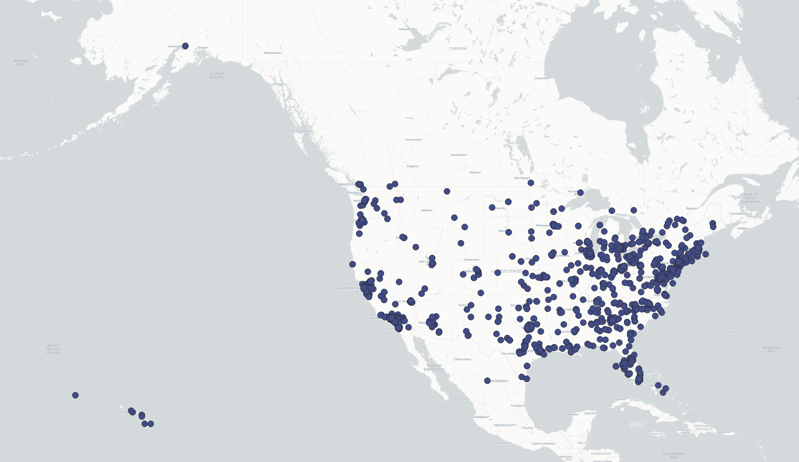
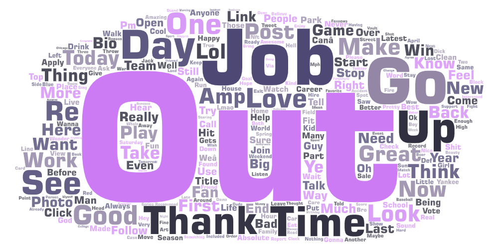

# Lab 2 by Edbert Aksama 
---
## Introduction 

In this assignment, I will be analyzing and visualizing geo-tagged tweets collected through the Twitter API. Specifically, I will be visualizing and comparing tweets posted in the morning and at night within the United States including Alaska and Hawaii. I decided to do a comparison on different time periods because I was curious to see the time period in which users are more active and how different time periods of the day would affect the sentiment that is inherent within the tweets that are posted. 

## Map Comparison 

**Map of morning tweets**

**Map of night tweets**

When comparing both maps of tweets, it can be seen that there are more twitter activity at night than in the more morning. This is also supported by the fact that there are two times more data points within the night time dataset than the morning dataset, which both can be found under the assignment's `assets` repository. Both morning and night tweets have similar geographic distribution. It appears that the tweets are not equally distributed, mainly concentrating in metropolitan areas during both morning and night. However, it is also observed that activity increases at night in more rural areas as some states have tweets at night but have no tweets in the morning. 

## Word Cloud Comparison

**Morning Tweets Word Cloud**

**Night Tweets Word Cloud**

The most prominent words in morning tweets includes Thank, Love, Go, Out, One, and Up while the most prominent words in night tweets includes Day, Thank, Out, Job, Go, and Time. Just comparing the list of prominent words for each time period, it seems that it would be hard to differentiate between different time periods as each list contains similar words. However, it can also be seen from the word clouds that the words love and up significantly decreases in prominence while out and job significantly increases in prominence as morning changes into night. This shift in prominence thus indicates a shift in sentiment. Therefore, it seems that the word cloud indicates that sentiment has shifted from a focus on gratefulness and excitement to a focus on work and going out.  

